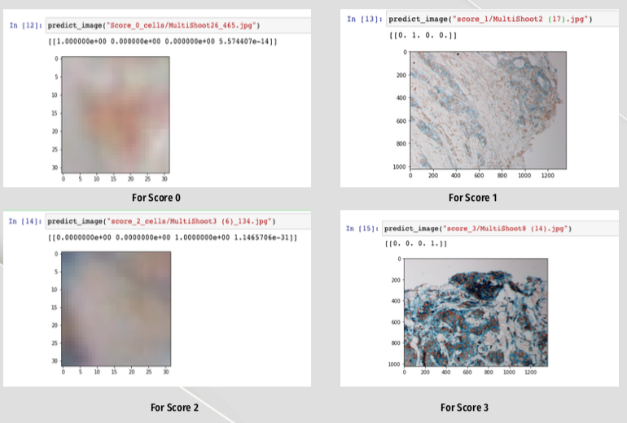

## IMMUNOHISTOCHEMISTRY (IHC) BREAST CANCER MICROSCOPE AUTOMATIC SCORING OF ITS IMAGES

This project is about classification of breast cancer tissue sections into four different levels (Levels 0,1, 2 and 3) on the given dataset.

• In the project, the performance results of patch-based approaches were examined
• Training microscope images by dividing them into patches
• 32x32 is used for model 
• The cell center in images is founded with INI files in given dataset
• For the cell center which is not fit in 32x32 patches, re- centralization is made according to edges of cells
• For image augmentation, images are generated with ImageDataGenerator class from keras

# Model
• Sequential model is used for CNN from keras
• For convolution,3x3 kernel is used
• For hidden layer,'relu'is used in activation
• To avoid overfitting,dropout value is chosen as 0.6
• For MaxPooling 2D,2x2 pool size is chosen
• The output of Dense layer count is 4,because there are four classes (Score 0,1,2 and 3)
• For output layer,'softmax'is chosen as activation function because of categorical classification

 After create model, model is compiled with “adam” optimizer, ”mse” loss and “accuracy” metrics
• Dataset is trained with 10 epoch and 1000 batch size, and model is evaluated, the results shown in pictures below

